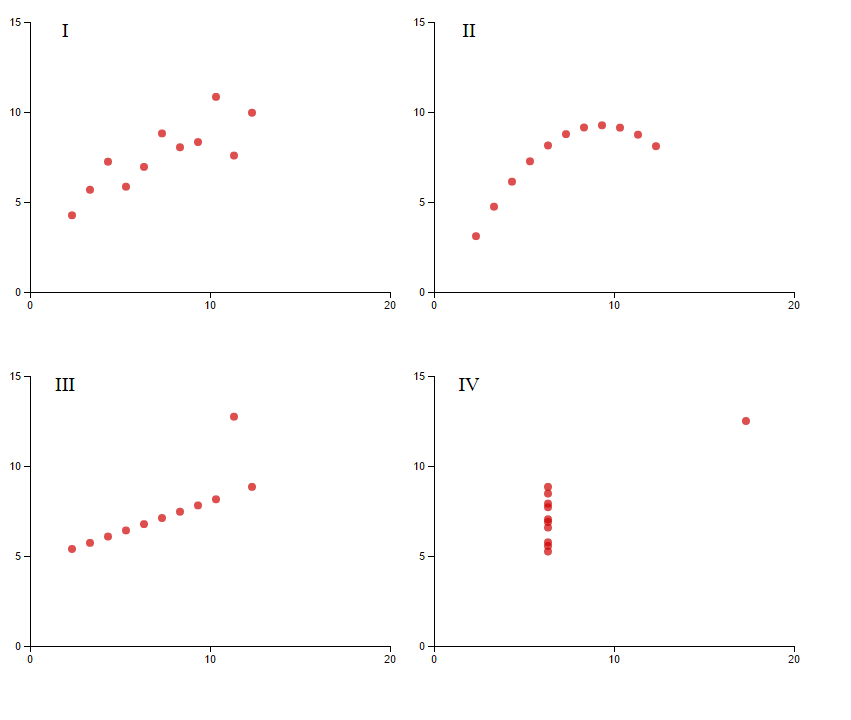

Cuarteto de Ascombe
===================

En este repositorio se desarrolla una visualización para demostrar la importancia de gráficar los datos antes de analizarlos utilizando la libreria d3.js: [Cuartero de Ascombe](http://jdash99.github.io/anscombe/)

El cuarteto de Ascombe comprende de cuatro conjuntos de datos que tienen propiedades estadisticas casi identicas, sin embargo, se ven muy diferentes al ser graficados.

##Conjunto de datos
|x1   |   y1    |  x2    |  y2    |  x3    |  y3    |  x4   |  y4   |
|-----|---------|--------|--------|--------|--------|-------|-------|
|10.0 |   8.04  |  10.0  |  9.14  |  10.0  |  7.46  |  8.0  |  6.58 |
|8.0  |   6.95  |  8.0   |  8.14  |  8.0   |  6.77  |  8.0  |  5.76 |
|13.0 |   7.58  |  13.0  |  8.74  |  13.0  |  12.74 |  8.0  |  7.71 |
|9.0  |   8.81  |  9.0   |  8.77  |  9.0   |  7.11  |  8.0  |  8.84 |
|11.0 |   8.33  |  11.0  |  9.26  |  11.0  |  7.81  |  8.0  |  8.47 |
|14.0 |   9.96  |  14.0  |  8.10  |  14.0  |  8.84  |  8.0  |  7.04 |
|6.0  |   7.24  |  6.0   |  6.13  |  6.0   |  6.08  |  8.0  |  5.25 |
|4.0  |   4.26  |  4.0   |  3.10  |  4.0   |  5.39  |  19.0 |  12.5 |
|12.0 |   10.84 |  12.0  |  9.13  |  12.0  |  8.15  |  8.0  |  5.56 |
|7.0  |   4.82  |  7.0   |  7.26  |  7.0   |  6.42  |  8.0  |  7.91 |
|5.0  |   5.68  |  5.0   |  4.74  |  5.0   |  5.73  |  8.0  |  6.89 |

##Propiedades estadisticas de los datos

* N = 11
* media de x para cada caso = 9.0
* media de y para cada caso = 7.5
* ecuación de la regresión lineal para cada caso: Y = 3 + 0.5X

##Gráfica

